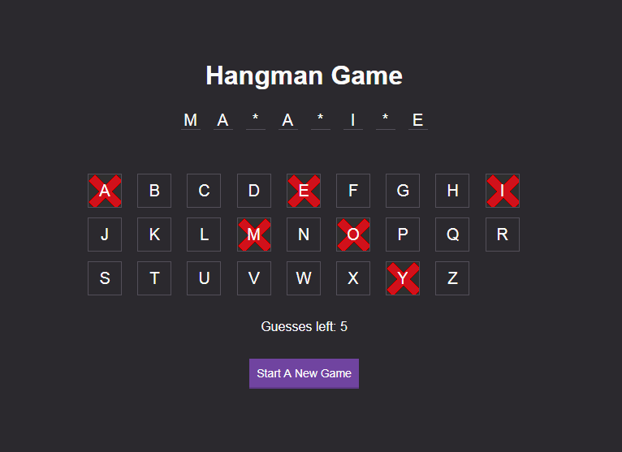

# Hangman App

## Intro
A word-guess game developed by vanilla Javascript(ES5) and built by Webpack. It is served by Node/Express and deployed at Heroku. It can also be built locally to a static web page.

## How to play
* Click 'Start A New Game' to start a new game.
* You have 7 chances to guess.
* Click letter buttons or press a corresponding letter on keyboard to make a guess.

## Reference Link
* Github: https://github.com/yangfcm/hangman-app
* Heroku: https://frozen-ocean-97528.herokuapp.com/

## Development Setup
1. Install Node at [https://nodejs.org/en/], shipped with NPM for package management
2. Install git at [https://git-scm.com/downloads] for version control
3. Clone from Github: `$ git clone https://github.com/yangfcm/hangman-app.git`
4. Navigate to _hangman-app_ directory, run `$ npm install`

## Building
* `$ npm run build` - Build for production environment
* `$ npm run build:dev` - Build for development environment

## Running
* `$ npm run start:dev` - Served by Node and run locally for development environment
* `$ npm run start:prod` - Served by Node and run locally for production environment
* `$ npm run dev-server` - Served by webpack-dev-server and run locally

## Tech stack
* HTML5/CSS3
* ES5
* Express
* Babel
* Webpack
